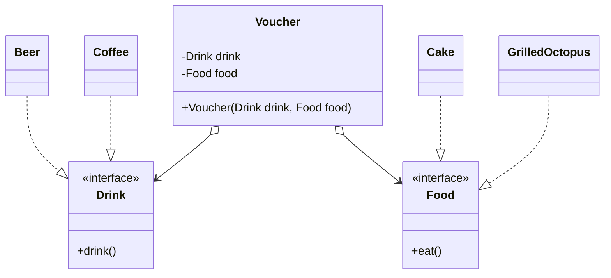
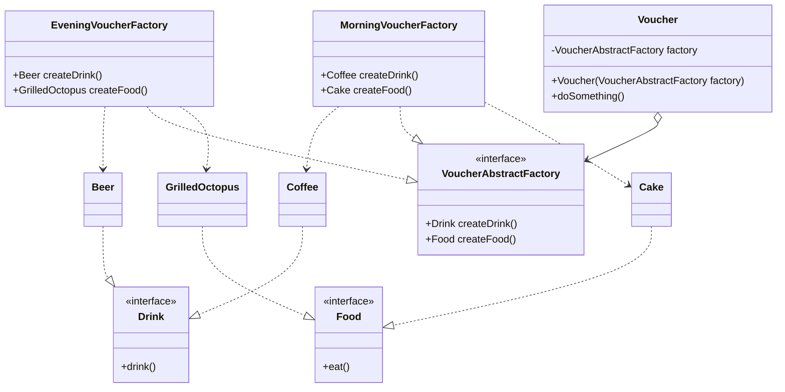

#creational

#abstract_factory

Abstract Factory
is a creational design pattern
that lets you produce
families of related objects
without specifying
their concrete classes.


Problem


Solution

```text
doSomething()

Drink drink = factory.createDrink()
Food food = factory.createFood()
```

public Drink createDrink() {
return new Coffee();
}

or

public Coffee createDrink() {
return new Coffee();
}


???

