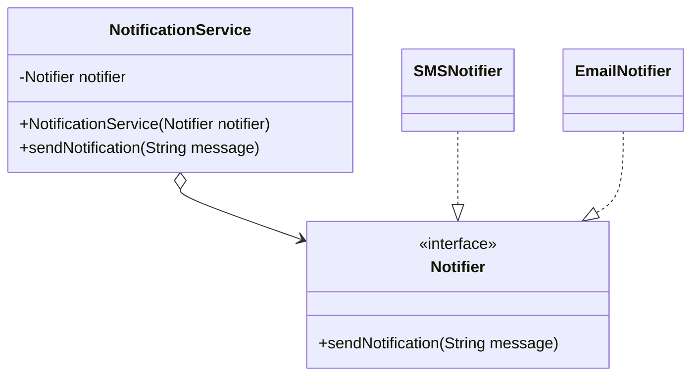
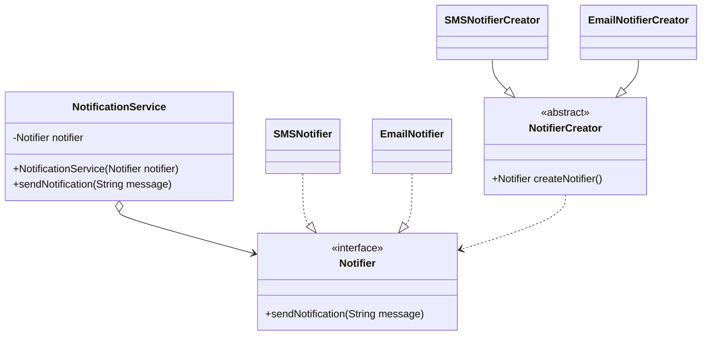

#creational

#factory_method

#(aka: virtual constructor)

#02

Factory Method
is a creational design pattern
that provides an interface
for creating objects in a superclass,
but allows subclasses
to alter the type of objects
that will be created.

Problem

Solution

